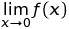

# 👋Hi, I'm Harshita

- 🖊 I'm a 2nd year student pursuing `B.Com` in `Accounting and Finance` from `St. Xavier's College, Kolkata`. 
- 🔭 I’m currently working on some mathematics problem.
- 🌱 I’m currently learning `Español` and doing college course work.
- 👯 I’m looking to collaborate on `Dance` for sure!
- 🤔 I’m looking for help with nothing right now but will share once it is required.
- 💬 Ask me about `Mathematics`, `Financial Accounting`, `Dance`, `Cooking`, `Stitching`
- 📫 How to reach me: 👈 check links on the left
- 😄 Pronouns: She/Her
- ⚡ Fun fact:  is not always 0.
